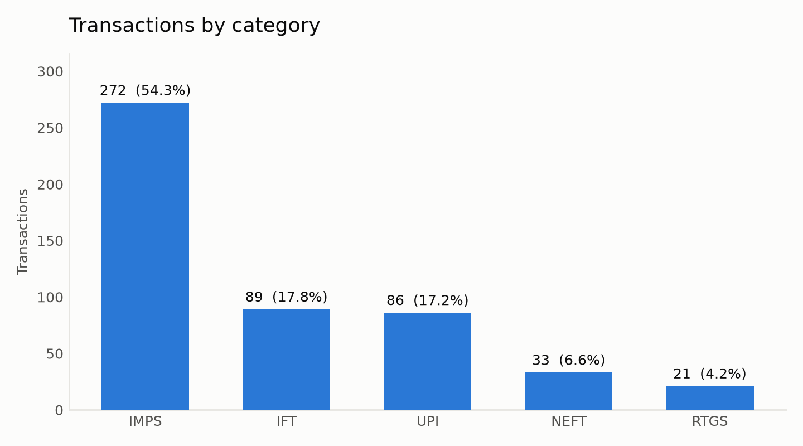
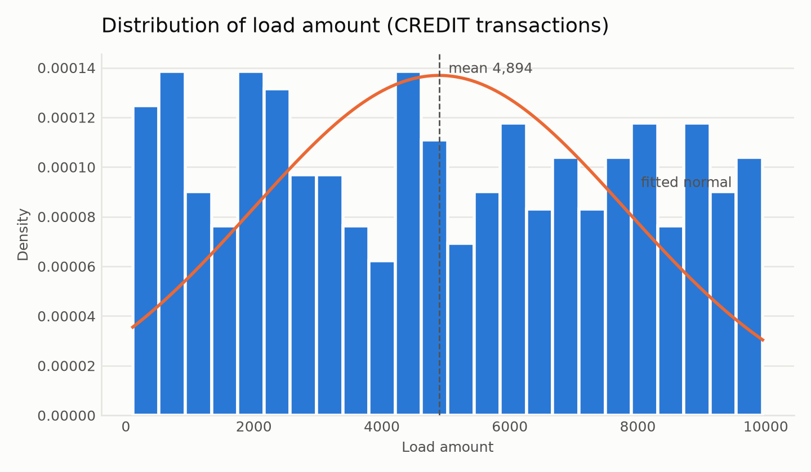
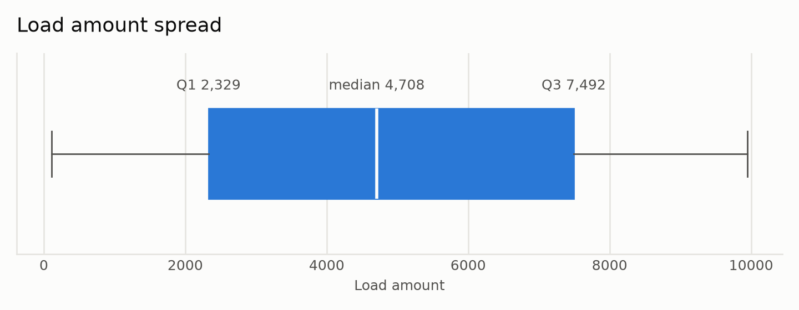
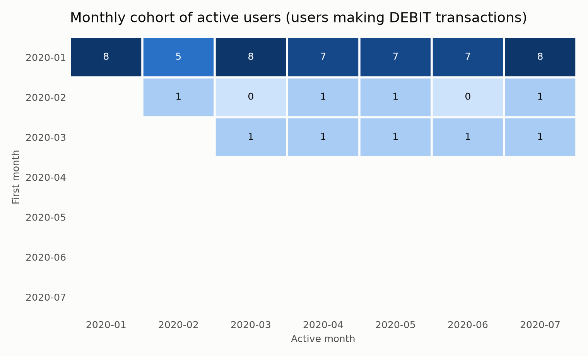

# Analytics — answers

Source: `Data Set (2).pdf`, extracted verbatim to
[`data/transactions.csv`](data/transactions.csv) by
[`scripts/extract_dataset.py`](../scripts/extract_dataset.py) — **501 transactions,
10 users, 352 of them CREDIT**, spanning 2020-01 to 2020-07.

The SQL lives in [`queries.sql`](queries.sql) and is executed straight from that
file by [`run_analytics.py`](run_analytics.py), so what is documented is what ran.

---

## Q1 — 7th highest DEBIT amount through IMPS

**9,525**

|   amount_rank |   seventh_highest_debit_amount |
|--------------:|-------------------------------:|
|             7 |                           9525 |

Read as the 7th highest *distinct* amount (`DENSE_RANK`): two debits of equal
value share one rank. If the intent were the 7th highest *row*, swap in
`ROW_NUMBER` — with this data both give the same answer, because there are no
duplicate IMPS debit amounts.

---

## Q2 — Transaction count by category

| category   |   txn_count |   debit_count |   credit_count |     total_amount |   pct_of_txns |
|:-----------|------------:|--------------:|---------------:|-----------------:|--------------:|
| IMPS       |         272 |            97 |            175 |      1.41439e+06 |         54.29 |
| IFT        |          89 |            26 |             63 | 444718           |         17.76 |
| UPI        |          86 |            20 |             66 | 417752           |         17.17 |
| NEFT       |          33 |             6 |             27 | 176340           |          6.59 |
| RTGS       |          21 |             0 |             21 |  94652           |          4.19 |

> **Note.** The brief lists four categories (UPI, IMPS, RTGS, NEFT), but the data also contains **IFT** on 89 rows. It is reported above rather than filtered out, so the counts sum to all 501 transactions.

---

## Q3 — Load amount: statistical summary, bell curve, box plot

"Load amount" is read as money loaded *into* the account — the **CREDIT**
transactions (352 rows).

| statistic          |      value |
|:-------------------|-----------:|
| count              |   352      |
| mean               |  4894.26   |
| median             |  4707.5    |
| std dev            |  2914.07   |
| min                |   108      |
| max                |  9950      |
| Q1                 |  2329      |
| Q3                 |  7492      |
| IQR                |  5163      |
| skewness           |     0.0489 |
| excess kurtosis    |    -1.2387 |
| lower fence        | -5415.5    |
| upper fence        | 15236.5    |
| outliers (1.5×IQR) |     0      |

### What the numbers actually say

The fitted normal curve is drawn to show how poorly it fits, and it fits badly:

* **Shapiro–Wilk W = 0.9493, p = 1.22e-09** — normality is rejected.
* Skewness 0.049 is near zero, so the data is symmetric, but
  excess kurtosis -1.239 is strongly **negative** — the
  distribution is flat-topped, not bell-shaped.
* A Kolmogorov–Smirnov test against a **uniform** distribution over
  [108, 9,950] gives D = 0.0436, p = 0.501 —
  uniform is not rejected.
* The box plot has **0 outliers** beyond 1.5×IQR, which is itself a
  tell: a genuine spend distribution is right-skewed with a long tail of large
  loads, and this one has no tail at all.

So load amount here is **approximately uniform between ~108 and
~9,950**, consistent with synthetic test data rather than real
transaction behaviour. The bell curve was requested and is provided, but the
honest reading is that a normal model is the wrong description of this variable.

---

## Q4 — Monthly cohort of active users (DEBIT transactions)

Cohort = the month of a user's **first DEBIT** transaction. Each cell counts the
distinct users from that cohort who made at least one DEBIT in that month.

| First month / Active month   |   2020-01 |   2020-02 |   2020-03 |   2020-04 |   2020-05 |   2020-06 |   2020-07 |
|:-----------------------------|----------:|----------:|----------:|----------:|----------:|----------:|----------:|
| 2020-01                      |         8 |         5 |         8 |         7 |         7 |         7 |         8 |
| 2020-02                      |           |         1 |         0 |         1 |         1 |         0 |         1 |
| 2020-03                      |           |           |         1 |         1 |         1 |         1 |         1 |
| 2020-04                      |           |           |           |           |           |           |           |
| 2020-05                      |           |           |           |           |           |           |           |
| 2020-06                      |           |           |           |           |           |           |           |
| 2020-07                      |           |           |           |           |           |           |           |

Reading the grid: blank below the diagonal is *structurally impossible* — a user
cannot be active before their own first transaction. A **0** on or after the
diagonal is a real result: that cohort existed and nobody in it transacted that
month. The two are deliberately not drawn the same way.

The 2020-04 to 2020-07 rows are empty because **no new cohort formed after March** —
all 10 users made their first DEBIT in Jan–Mar, and 8 of them in January alone.
With a user base this small the grid is a shape check rather than a retention
finding: the January cohort's 5 in February is one quiet month, not churn.

---

## Q5 — Top 10 percentile of users by net amount (DEBIT − CREDIT)

|   user_id |   net_amount |   total_debit |   total_credit |
|----------:|-------------:|--------------:|---------------:|
|         8 |       -35804 |        129734 |         165538 |

`NTILE(10)` over 10 users puts exactly one user in the top decile. That is
the correct answer to the question as asked, and the query scales unchanged as
the user base grows — but with a 10-user dataset it is worth saying plainly that
"top 10 percentile" and "top 1 user" are the same thing here.

Worth flagging: **every user's net amount is negative**, because the dataset is
352 credits against 149 debits. So "highest net amount (DEBIT − CREDIT)" selects
the user who is *least* net-credited, not one who is net-debited. The ranking is
correct as specified; the sign is a property of the data, not of the query.

Full per-user ranking for context:

|   user_id |   total_debit |   total_credit |   net_amount |
|----------:|--------------:|---------------:|-------------:|
|         8 |        129734 |         165538 |       -35804 |
|         1 |         73830 |         111143 |       -37313 |
|         3 |        106386 |         146026 |       -39640 |
|        10 |         94295 |         152722 |       -58427 |
|         4 |        100477 |         188518 |       -88041 |
|         7 |         75500 |         188696 |      -113196 |
|         6 |         59334 |         176723 |      -117389 |
|         9 |         58316 |         186106 |      -127790 |
|         2 |         70901 |         203354 |      -132453 |
|         5 |         56298 |         203953 |      -147655 |
